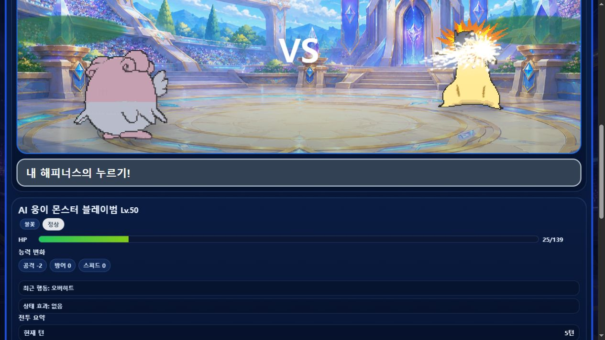

# 푸끼몬 챔피언스 온라인

> 3마리 팀 선택, AI 연습전, 실시간 대전 로비와 모험 모드를 구현한 포켓몬 스타일 온라인 배틀 게임입니다.


## 1. 프로젝트 소개

`푸끼몬 챔피언스 온라인`은 도시별 아레나 로비에서 팀을 고르고 실시간 배틀에 참가하는 몬스터 배틀 게임입니다. 12마리 후보 중 3마리 팀을 만들고, 기술·타입·HP·PP·상태 변화에 따라 행동을 선택합니다. 혼자서도 AI 연습전과 1층부터 이어지는 모험 모드를 플레이할 수 있습니다.

## 2. 플레이 미리보기



*팀 교체, HP 바, 전투장, 기술 효과와 턴 로그가 함께 보이는 AI 연습전 장면입니다.*

## 3. 구현한 핵심 기능

- 로그인 후 도시별 아레나에 입장하는 온라인 로비와 접속자·채팅·랭킹
- 12마리 후보에서 3마리를 선택하는 팀 구성과 선두·교체 순서 설계
- 타입 상성, PP, 상태 효과, 교체, 기절, 급소, 반동 등을 포함한 배틀 엔진
- AI 연습전과 턴 제한을 갖춘 1:1 3마리 싱글 배틀
- 포획·경험치·보상·진화·기술 학습으로 이어지는 모험 모드
- 관리자·밸런스·기술 데이터 관리 화면을 통한 콘텐츠 운영 도구

## 4. 만들며 배우고 싶었던 것 · 습득한 것

**목표**

턴제 전투의 복잡한 규칙을 실제 온라인 대전 흐름에 연결하고, 데이터가 늘어나도 유지할 수 있는 배틀 엔진을 만들고자 했습니다.

**습득**

- Socket.IO 이벤트로 로그인·로비·팀 선택·턴 처리 상태를 동기화하는 경험
- 타입 상성, 기술, 상태이상, PP를 독립 모듈로 나누는 게임 도메인 설계
- AI 행동 선택과 전투 로그를 통해 플레이어가 결과를 이해하게 하는 피드백 설계
- 대전 모드와 모험 모드가 같은 전투 규칙을 공유하도록 통합하는 방법
- 방, 사용자, 배틀 상태를 서버 중심으로 안전하게 관리하는 기초

## 5. 기술 스택

| 영역 | 사용 기술 | 활용 |
| --- | --- | --- |
| Client | HTML, CSS, JavaScript | 로비, 팀 선택, 배틀 UI, 모험 화면 |
| Server | Node.js, Express | 정적 파일 제공, API, 게임 서버 실행 |
| Realtime | Socket.IO | 로비·채팅·대전 이벤트 동기화 |
| Game Logic | JavaScript modules | 타입 상성, 기술, 배틀 엔진, AI |
| Data | JSON assets | 포켓몬, 기술, 보상, 밸런스 데이터 |

## 6. 구조

```text
server.js          ─ Express·Socket.IO 서버와 실시간 게임 흐름
src/battleEngine.js ─ 턴, 기술, 피해, 상태 효과 처리
src/typeChart.js    ─ 타입 상성 규칙
src/dataLoader.js   ─ 포켓몬·기술·보상 데이터 로딩
public/             ─ 로비·배틀·모험 UI와 이미지 자산
```

## 7. 로컬 실행

```bash
npm install
npm start
```

기본 주소는 `http://localhost:3000`입니다. 다른 포트가 필요하면 환경 변수 `PORT`를 지정해 실행할 수 있습니다.

## 8. 검증

```bash
npm run check
```

서버와 핵심 게임 로직 모듈의 JavaScript 문법 검사를 실행합니다.

## 9. 다음 개선 방향

- 배틀 리플레이·관전·대전 기록을 추가해 경쟁 플레이 경험 강화
- 계정·랭킹 데이터를 영속 저장소와 연결
- 모바일 조작과 대전 중 정보 밀도를 더 세밀하게 다듬기

---

개발자: 정승 · 실시간 게임 서버, 턴제 배틀 규칙, 게임 데이터 모델링을 학습하기 위한 개인 프로젝트
